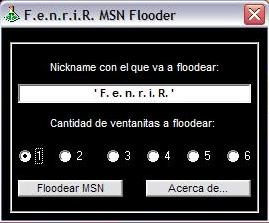



## Fenrir MSN Flooder

### Description

This code, flood your MSN contacts with 1 to 6 pop-ups.
 
### More Info
 
Begginer knowledge of VB6 and how to use Windows MSN Messenger API's.

             |
---                |---
**Submitted On**   |2004-06-15 21:36:04
**By**             |[F\.e\.n\.r\.i\.R\.](https://github.com/Planet-Source-Code/PSCIndex/blob/master/ByAuthor/f-e-n-r-i-r.md)
**Level**          |Beginner
**User Rating**    |4.7 (14 globes from 3 users)
**Compatibility**  |VB 6\.0
**Category**       |[Jokes/ Humor](https://github.com/Planet-Source-Code/PSCIndex/blob/master/ByCategory/jokes-humor__1-40.md)
**World**          |[Visual Basic](https://github.com/Planet-Source-Code/PSCIndex/blob/master/ByWorld/visual-basic.md)
**Archive File**   |[Fenrir\_MSN1758546172004\.zip](https://github.com/Planet-Source-Code/f-e-n-r-i-r-fenrir-msn-flooder__1-54403/archive/master.zip)

